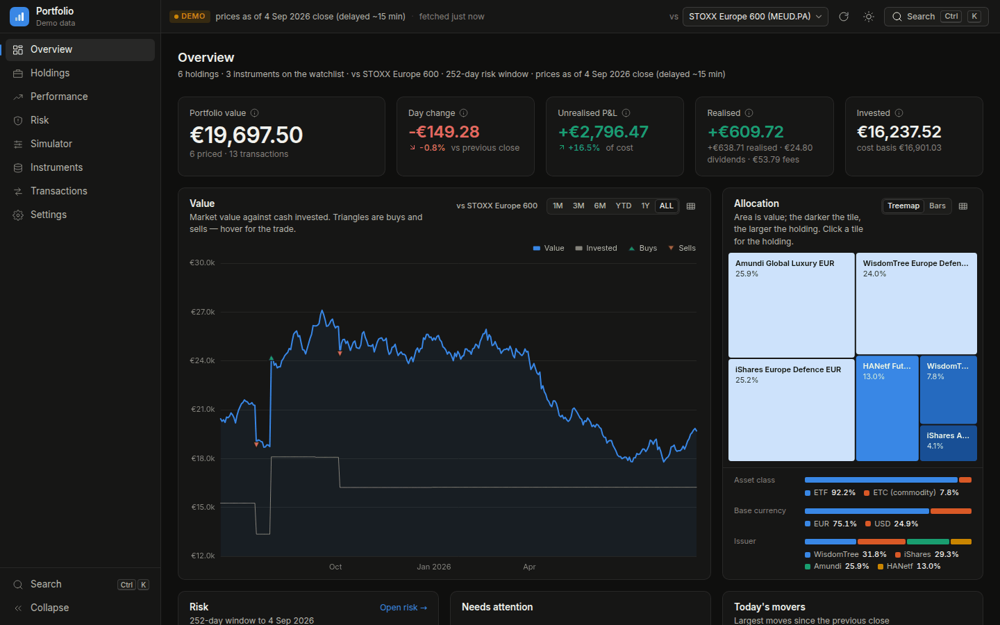
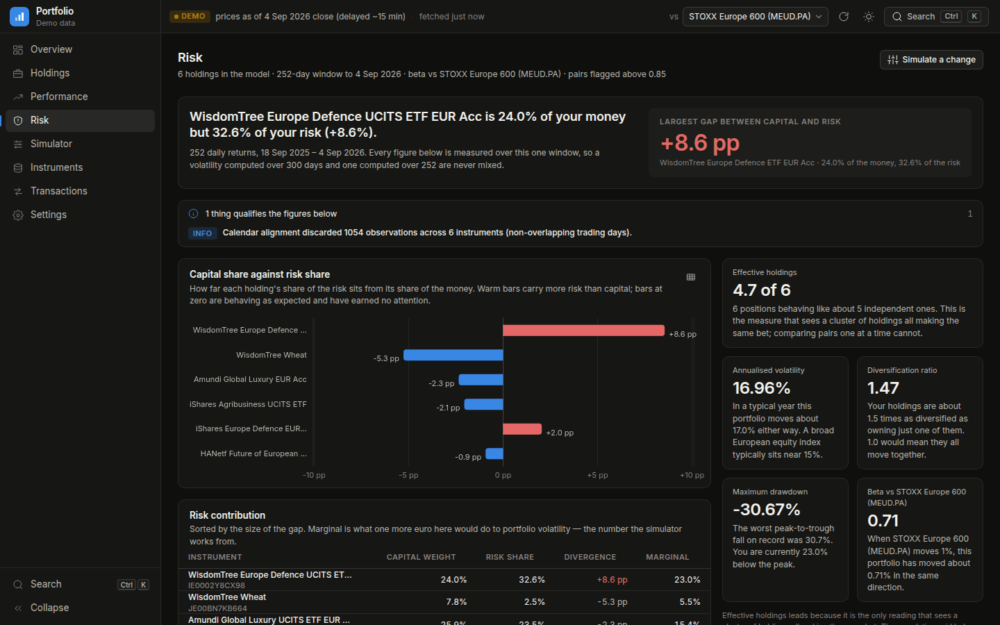
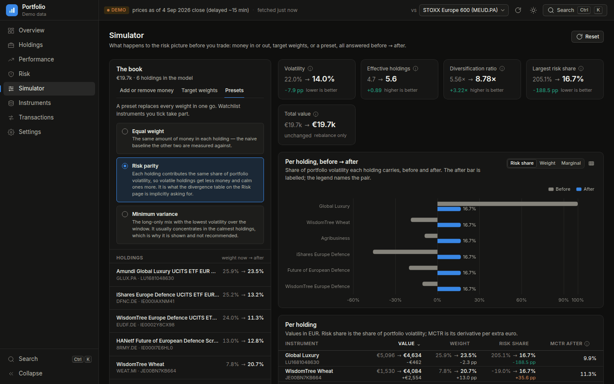
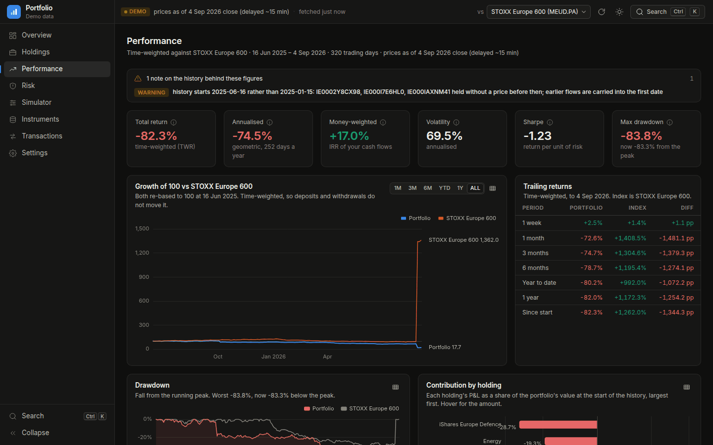
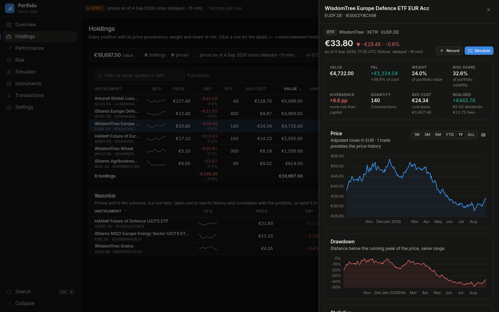

# Portfolio tracker

A personal investment portfolio tracker for European-listed ETFs and ETCs,
keyed on ISIN, with risk analytics you can read against a textbook.

The number no broker app shows you is the gap between a holding's share of
your money and its share of your risk. That gap is the headline of this tool;
everything else — performance attribution, value at risk, correlation
clusters, a what-if simulator, rebalancing — is supporting evidence for it.



## Run it

```bash
pip install -e ".[app,data]"
portfolio serve                       # opens http://127.0.0.1:8765
```

It starts in **demo mode** on ten real reference instruments and a synthetic
ledger, clearly labelled on every page. Switch to your own data from the
settings page or with `portfolio serve --mode user`; your instruments and
ledger live in `portfolio/data_store/user/` (gitignored) as plain CSV that
outlives the tool.

No network? `portfolio serve --provider fixture` runs the full application on
deterministic synthetic prices.

## What it does

| Page | What you get |
|---|---|
| **Overview** | Portfolio value, day change, unrealised and realised P&L, value history against a benchmark, allocation, the risk headline, and an alert feed (stale prices, concentration, correlated holdings). |
| **Holdings** | Dense sortable table with sparklines, weight, risk share, day change and provenance for every price. Click a row for the holding's price chart with your trades marked, drawdown, beta and correlation to the rest of the book. |
| **Performance** | Time-weighted and money-weighted (XIRR) returns, benchmark comparison, drawdown, monthly and calendar-year returns, contribution by holding, rolling volatility and beta, Sharpe / Sortino / Calmar. |
| **Risk** | Capital share against risk share (component contribution to volatility), effective number of holdings, diversification ratio, beta against a named benchmark, value at risk (historical, parametric, Cornish-Fisher) and expected shortfall, worst periods, stress scenarios, the correlation grid, and correlation **clusters** — the group a pairwise grid cannot see. |
| **Simulator** | Add or remove money from any holding or watchlist instrument, set target weights, or apply equal-weight / risk-parity / minimum-variance presets, and see volatility, effective holdings and every risk share move before you trade. Produces the trade list. |
| **Instruments** | Add by ISIN: resolved via OpenFIGI, every listing probed, US ticker collisions refused outright, thin and stale series flagged. Nothing is saved until you confirm the listing you saw. |
| **Transactions** | Append-only ledger. Corrections are voids, never edits. CSV import with column detection (European decimal commas and semicolons included) and duplicate detection. CSV and Excel export. |

Prices are delayed and are never presented as live. A holding that cannot be
valued is named and excluded from the total rather than valued at zero. A
missing FX rate raises rather than defaulting to parity.

| Risk | Simulator (risk parity) |
|---|---|
|  |  |
| **Performance** | **Holding detail** |
|  |  |

Every chart has a table twin (the grid icon in its corner), the whole
application is reachable from the keyboard (`?` lists the shortcuts, `Ctrl K`
opens the command palette), and dark and light themes are designed
separately rather than inverted.

## Architecture

```
portfolio/
  core/    pure numpy + pandas: ledger, positions, returns, risk, performance,
           VaR, simulator. No network, no UI, importable and tested alone.
  data/    CSV store, SQLite price cache, yfinance + OpenFIGI providers,
           daily FX, CSV import/export, deterministic offline provider.
  api/     FastAPI: one cached snapshot per (mode, benchmark, lookback),
           invalidated by ledger writes or an explicit refresh. Projects only.
  web/     Zero-build single-page client: Preact + htm + ECharts, vendored.
  agents/  Decision policies. A policy is an object with one method, not a
           language model: it sees a point-in-time view and returns target
           weights with a written reason. Includes the trading cost model.
  eval/    The walk-forward harness, the statistics that say whether a result
           means anything, the pre-registration log, and the controls that
           calibrate all of it.
```

The layering is enforced by tests, not by convention: `core/` cannot import a
web framework or a network client, `api/` cannot import numpy, and `agents/`
cannot import `eval/` — a policy that could tell it was being backtested
could behave differently there. See
[docs/ARCHITECTURE.md](docs/ARCHITECTURE.md) for the contract between layers.

## Evaluating a strategy

```bash
portfolio controls          # calibrate the harness before trusting a result
```

A backtest produces a confident Sharpe ratio whether or not it is measuring
anything, so the harness is calibrated before any strategy is run against it:

| Control | What it proves |
|---|---|
| **Negative** | A no-skill policy with matched turnover, over 200 seeds. The harness must show no edge, reject a true null at close to 5%, and produce t-statistics with standard deviation 1 — a standard error wrong by a factor shows up here as its reciprocal. Measured at both overlap settings, because it once ran only at the one the real backtest does not use. |
| **Positive** | A policy given a known probability of foreseeing the next bar, in a world where its true Sharpe is available in closed form. The measured figure must match the injected one. Without this, "we found no edge" and "we could not have found an edge" are the same sentence. |
| **Canary** | A policy that decides today using tomorrow's close. It must produce an absurd Sharpe. If it does not, the data feed leaks. |
| **Leak detector** | Rewrites every price after a date and re-runs. Everything decided before it must be bit-identical. It also refuses to run when wired so that it could not fail. |

Costs are mandatory, not optional: `walk_forward` takes a cost model, and the
one in `agents/execution.py` is per broker, per instrument and side-aware,
because at a real account all three vary. Every input is either read off a
contract note or marked as an estimate, and the model prints which — and how
much of the answer each is carrying:

> Transaction tax: 1 of 7 rates was read off a contract note, covering 17% of
> the book by value. Of the remaining 6: 5 (80%) assumed to sit in the same
> band, 1 (3%) not recorded at all, so trades in it are refused rather than
> priced.
>
> Weighted by what the model actually charges on a round trip, 9% of the cost
> figure rests on inputs read off a document and 91% on estimates, of which
> the bid-ask spread is 39%: it is paid inside the execution price and appears
> on no contract note.

Where those facts live is `portfolio instruments`:

```bash
portfolio instruments list                        # what is evidence, what is not
portfolio instruments set --all --broker MeDirect
portfolio instruments set IE00B579F325 --broker Keytrade --not-tradeable
portfolio instruments set DE000A2QP372 --tob-rate 0.12% --observed
```

Rates parse as `0.0012`, `0,0012` or `0.12%` interchangeably and a bare
`0.12` is refused as ambiguous, because a hundredfold error from one
keystroke has nothing to notice it by. `--observed` cannot be set without the
number it describes. A book written before these columns existed is migrated
on load, with a notice naming every value it derived and every one it
refused to.

```bash
portfolio backtest erc      # equal risk contribution against buy-and-hold
```

### Directing new money

```bash
portfolio allocate 5000                 # where a purchase should go
portfolio allocate 5000 --target 1.0    # and: what would reaching 1.0 take?
portfolio backtest allocator            # replay your real purchases
```

In an account with no regular contribution and no leverage, a scheduled
rebalance is a sell plus a buy — tax and spread twice, for every unit of
drift removed. New money is the one rebalancing channel that costs nothing
extra, because the purchase was going to happen anyway. So the allocator
chooses **where** it goes, subject to `b ≥ 0`: it never proposes a sale.

Buy-only can only reduce an overweight risk share by dilution, so the output
carries three numbers rather than one — where the book is now, the best
reachable *with this much money*, and the best reachable if selling were
allowed. It answers the inverted question too, which is usually the
decision-relevant one — *reaching 1.00 would take about 40,000 EUR against a
book of 17,000* — and when the answer is that nothing reaches it, it says
what the best reachable is and at what amount, because "no" on its own is
not a decision. And it says when the destination hardly matters:

> At 500 EUR it does not much matter where this goes: the best and worst
> destinations differ by 0.115 of dispersion. The smallest purchase that
> moves it meaningfully is about 647 EUR.

Whole shares only, with the rounding penalty shown against the continuous
optimum; per-broker minimum trade sizes derived from each fee schedule; and a
table of what each destination would cost against what it would buy, so a
wide-spread holding cannot quietly consume the improvement it delivers.

`buyable` is a separate flag from `tradeable`. A holding at a second broker
cannot be rebalanced against the rest of the book but can be bought with new
money perfectly well; reading one flag as the other gets the constraint wrong
in one direction or the other.

**More money does not always help, and the tool no longer pretends it does.**
Rescaling a reachable allocation leaves every risk share unchanged and stays
affordable, so the best reachable dispersion falls as the purchase grows —
*provided every holding can receive it*. One that cannot has its weight pinned
at `v/(V+C)`, an equality that moves with the money rather than a bound that
relaxes, so more cash dilutes it towards a zero risk share and past some
amount the floor turns and climbs. On the demo book it converges to 10/7,
which is what seven equal risk shares and three zeros disperse to. The inverse
question is therefore answered by a scan rather than a bisection: the amount
named always reaches the target, and what a pinned holding costs is the
guarantee that nothing smaller would.

The allocator is evaluated by **replaying the real ledger** — same dates,
same amounts, destination changed — because its claim is about risk
structure, not return. Dispersion is computed rather than estimated, so that
comparison carries no sampling error; realised volatility is estimated and
carries its standard error, and with eight purchases the report says plainly
that it is not a ranking.

reports the policy gross, net and against the benchmark, then the **breakeven
turnover** — the level at which the gross edge is entirely consumed by the
trading it takes to capture it. That is the decision criterion, and it
separates the two ways a policy fails: no edge at all, or an edge too small to
trade. The benchmark is always buy-and-hold of the portfolio you already own,
started from the same weights, since that is the actual alternative.

Holdings can be marked non-tradeable. A position at a second broker cannot be
rebalanced against the rest of the book — that is a cash transfer between
institutions taking about a week, not a trade — so its weight is exogenous.
It stays in the risk model, since it genuinely affects every correlation, and
the referee rejects any proposal that moves it. A holding whose trading cost
cannot be established is frozen the same way and for a stated reason: refusing
to price it is absolute, but refusing to produce any result at all was not the
same thing. Equal risk contribution then solves over the restricted simplex
and reports what the constraint cost.

Every statistic is reported with its uncertainty, and every Sharpe ratio is
printed with its standard error beside it. A ratio the sample cannot
establish is reported as undetermined, with the track record length that
*would* establish it — a true annual Sharpe of 0.5 needs sixteen years of
daily data to reach t = 2, and the tool says so rather than printing a
number. Attempts are pre-registered in `research/registry.jsonl`, because the
deflated Sharpe ratio takes the number of attempts as an argument and a count
that omits the failures is not a count.

The comparison against buy-and-hold is **paired and risk-adjusted**, and it
reports two statistics because they answer different questions.

The raw active return — policy minus benchmark, day by day — is the realised
cost of the mandate *in that window*, and it is reported rather than tested:
a policy that holds less risk underperforms a rising benchmark by
construction, so a significant result there is a tautology. The same policy
in a falling window comes out significantly better. The tool demonstrates
this on itself.

The comparison that carries out of sample is at matched risk: the difference
of the two Sharpe ratios, tested with Jobson-Korkie plus Memmel's correction
at a correlation that is measured and printed. Two legs holding one book
correlate at about 0.99, so almost all of each marginal error is the same
error and cancels — which is what makes the test possible. Below t = 2 the
tool says *indistinguishable* rather than ranking them. It also splits the
raw gap into the part explained by the volatility ratio and the residual, and
states that matching risk means leverage a cash account cannot apply: the raw
gap is what the account lost, the residual is what the strategy cost.

The 1.5 alarm is applied to the matched-risk gap as well as to the level. A
level above 1.5 is a property of the window and the benchmark shares it; a
leak inside a policy cannot lift a benchmark that never trades.

A day on which a held instrument did not trade is never a 0.00% return.
Positions are valued at the last price that printed, so the missed move lands
on the next one and the compounded return is exactly right; the day itself is
excluded from every variance, and the count of such days is printed beside
the observation count.

Paper trading only. Automatic execution on a real account is portfolio
management under MiFID II; `portfolio/tests/test_paper_only.py` fails if a
live broker endpoint appears anywhere in the repository.

Performance: every network call goes through a thread pool and an on-disk
cache; history is fetched incrementally and quotes expire after 15 minutes.
Nothing polls. After the first load, a page is a dictionary lookup.

## Tests

```bash
pip install -e ".[app,data,test]"
pytest                    # everything, including the API against the offline provider
pip install -e ".[test]" && pytest     # core only: proves core needs nothing else
```

## Data providers

yfinance for prices, OpenFIGI for identity. Both are free and keyless; an
`OPENFIGI_API_KEY` raises the identity rate limit. The provider spike that
chose them, with its evidence, is in `spike/`.
